# MVP 功能程序流程图集

> **配套文档**：《[交易所MVP-做与不做及最小流程.md](交易所MVP-做与不做及最小流程.md)》——每个流程图覆盖该功能情况表的**全部分支**，分支边上标注「情况n」对应原文档情况表编号，便于核对遗漏。
>
> **图例**：圆角框 = 开始/结束；菱形 = 判断/分支；矩形 = 处理动作；虚线 = 异常/旁路入口。
>
> **覆盖范围**（对应 MVP 决策总表中 ✅ 的 9 个模块）：
> 1. 账户与身份（注册/登录/忘记密码/KYC/2FA/安全项修改）
> 2. 充值（扫块入账/错链人工处理）
> 3. 现货交易（下单/撮合/撤单/行情）
> 4. 提现（用户申请/人工审核与打款）
> 5. 记账与对账（账务入口/日终对账）
> 6. Admin 后台（操作审计/交易对配置）
> 7. 邮件通知

---

## 1. 账户与身份

### 1.1 注册流程

覆盖情况：3.1 表 #1~#6

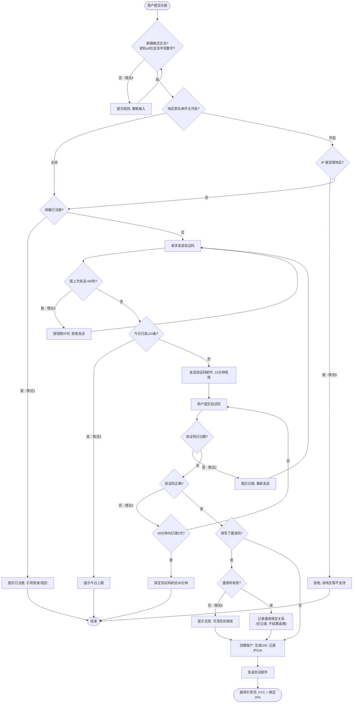
```mermaid
flowchart TD
    S([用户提交注册]) --> A{"邮箱格式合法?<br/>密码≥8位且含字母数字?"}
    A -->|"否 · 情况4"| E1["提示规则, 重新输入"] --> A
    A -->|"是"| B{"地区黑名单开关开启?"}
    B -->|"关闭"| D
    B -->|"开启"| C{"IP 属受限地区?"}
    C -->|"是 · 情况5"| X1["拒绝: 该地区暂不支持"] --> Z([结束])
    C -->|"否"| D{"邮箱已注册?"}
    D -->|"是 · 情况1"| X2["提示已注册, 引导登录/找回"] --> Z
    D -->|"否"| G["请求发送验证码"]
    G --> G1{"距上次发送<60秒?"}
    G1 -->|"是 · 情况3"| X3["按钮倒计时, 拒绝发送"] --> G
    G1 -->|"否"| G2{"今日已发≥10条?"}
    G2 -->|"是 · 情况3"| X4["提示今日上限"] --> Z
    G2 -->|"否"| H["发送验证码邮件, 10分钟有效"]
    H --> I["用户提交验证码"]
    I --> J{"验证码已过期?"}
    J -->|"是 · 情况2"| X5["提示过期, 重新发送"] --> G
    J -->|"否"| K{"验证码正确?"}
    K -->|"否 · 情况2"| K1{"30分钟内已错5次?"}
    K1 -->|"是"| X6["锁定验证码校验30分钟"] --> Z
    K1 -->|"否"| I
    K -->|"是"| L{"填写了邀请码?"}
    L -->|"是"| M{"邀请码有效?"}
    M -->|"否 · 情况6"| N["提示无效, 可清空后继续"]
    M -->|"是"| O["记录邀请绑定关系<br/>(仅记录, 不结算返佣)"]
    L -->|"否"| P
    N --> P["创建账户: 生成UID, 记录IP/UA"]
    O --> P
    P --> Q["发送欢迎邮件"]
    Q --> Z2([跳转引导页: KYC + 绑定2FA])
```

### 1.2 登录流程

覆盖情况：3.2 表 #1~#7

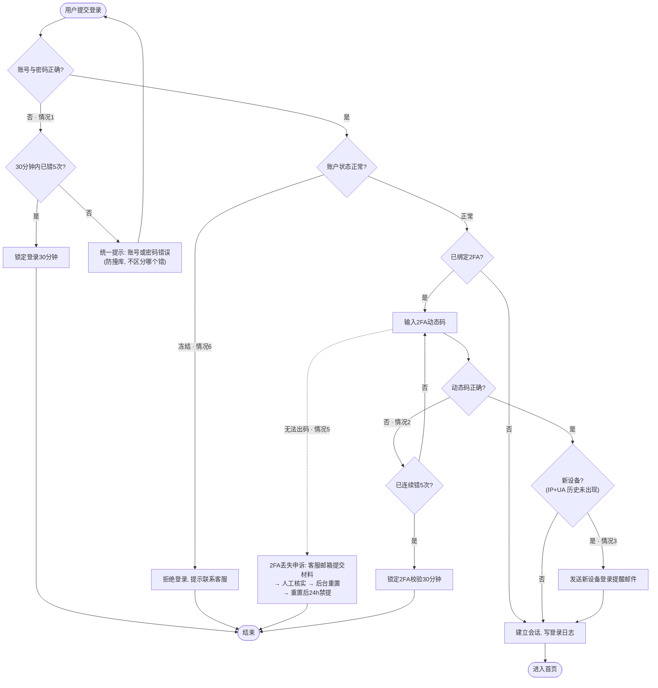
```mermaid
flowchart TD
    S([用户提交登录]) --> A{"账号与密码正确?"}
    A -->|"否 · 情况1"| B{"30分钟内已错5次?"}
    B -->|"是"| X1["锁定登录30分钟"] --> Z([结束])
    B -->|"否"| A1["统一提示: 账号或密码错误<br/>(防撞库, 不区分哪个错)"] --> S
    A -->|"是"| D{"账户状态正常?"}
    D -->|"冻结 · 情况6"| X2["拒绝登录, 提示联系客服"] --> Z
    D -->|"正常"| F{"已绑定2FA?"}
    F -->|"否"| I
    F -->|"是"| G["输入2FA动态码"]
    G -.->|"无法出码 · 情况5"| GL["2FA丢失申诉: 客服邮箱提交材料<br/>→ 人工核实 → 后台重置<br/>→ 重置后24h禁提"]
    GL --> Z
    G --> G1{"动态码正确?"}
    G1 -->|"否 · 情况2"| G2{"已连续错5次?"}
    G2 -->|"是"| X3["锁定2FA校验30分钟"] --> Z
    G2 -->|"否"| G
    G1 -->|"是"| H{"新设备?<br/>(IP+UA 历史未出现)"}
    H -->|"是 · 情况3"| H1["发送新设备登录提醒邮件"]
    H -->|"否"| I
    H1 --> I["建立会话, 写登录日志"] --> Z2([进入首页])
```

### 1.3 忘记密码流程

覆盖情况：3.2 表 #4

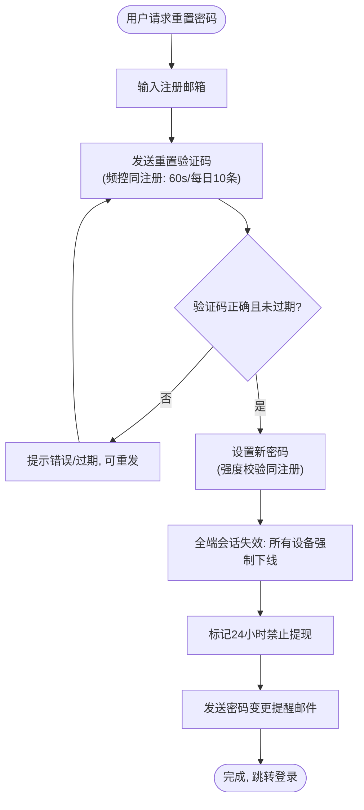
```mermaid
flowchart TD
    S([用户请求重置密码]) --> A["输入注册邮箱"]
    A --> B["发送重置验证码<br/>(频控同注册: 60s/每日10条)"]
    B --> C{"验证码正确且未过期?"}
    C -->|"否"| C1["提示错误/过期, 可重发"] --> B
    C -->|"是"| D["设置新密码<br/>(强度校验同注册)"]
    D --> E["全端会话失效: 所有设备强制下线"]
    E --> F["标记24小时禁止提现"]
    F --> G["发送密码变更提醒邮件"]
    G --> Z([完成, 跳转登录])
```

### 1.4 KYC 认证流程（方案A 人工审核）

覆盖情况：3.3 表 #1~#8

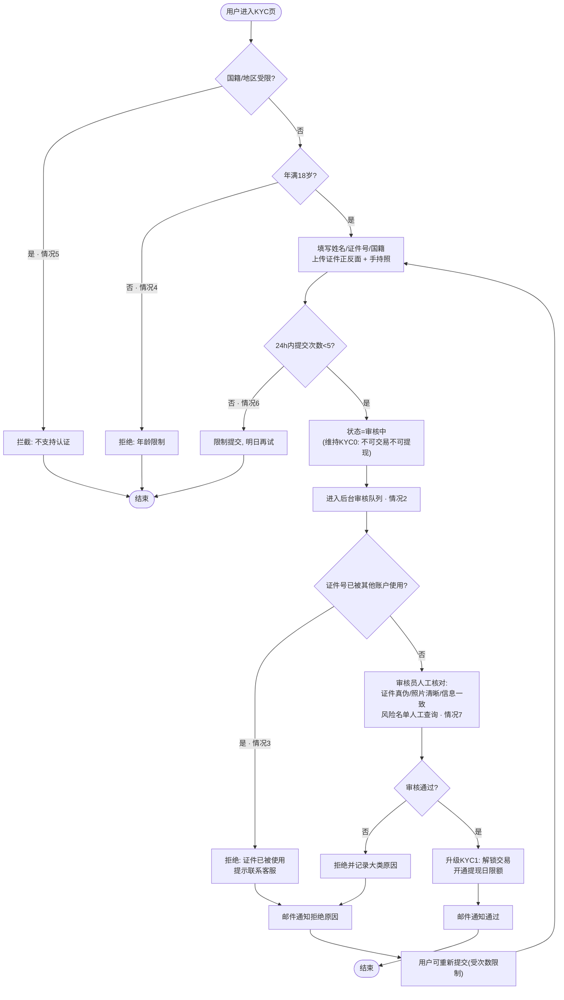
```mermaid
flowchart TD
    S([用户进入KYC页]) --> A{"国籍/地区受限?"}
    A -->|"是 · 情况5"| X1["拦截: 不支持认证"] --> Z([结束])
    A -->|"否"| B{"年满18岁?"}
    B -->|"否 · 情况4"| X2["拒绝: 年龄限制"] --> Z
    B -->|"是"| C["填写姓名/证件号/国籍<br/>上传证件正反面 + 手持照"]
    C --> D{"24h内提交次数<5?"}
    D -->|"否 · 情况6"| X3["限制提交, 明日再试"] --> Z
    D -->|"是"| E["状态=审核中<br/>(维持KYC0: 不可交易不可提现)"]
    E --> F["进入后台审核队列 · 情况2"]
    F --> G{"证件号已被其他账户使用?"}
    G -->|"是 · 情况3"| X4["拒绝: 证件已被使用<br/>提示联系客服"]
    G -->|"否"| H["审核员人工核对:<br/>证件真伪/照片清晰/信息一致<br/>风险名单人工查询 · 情况7"]
    H --> I{"审核通过?"}
    I -->|"否"| J["拒绝并记录大类原因"]
    I -->|"是"| K["升级KYC1: 解锁交易<br/>开通提现日限额"] --> L["邮件通知通过"] --> Z2([结束])
    J --> M["邮件通知拒绝原因"]
    X4 --> M
    M --> N["用户可重新提交(受次数限制)"]
    N --> C
```

> 方案B（第三方供应商）差异：将「后台审核队列→人工核对」节点替换为「供应商回调 → 三态映射（通过/拒绝/待审）」，其余流程不变。

### 1.5 2FA 绑定流程

覆盖情况：3.4 表 #1

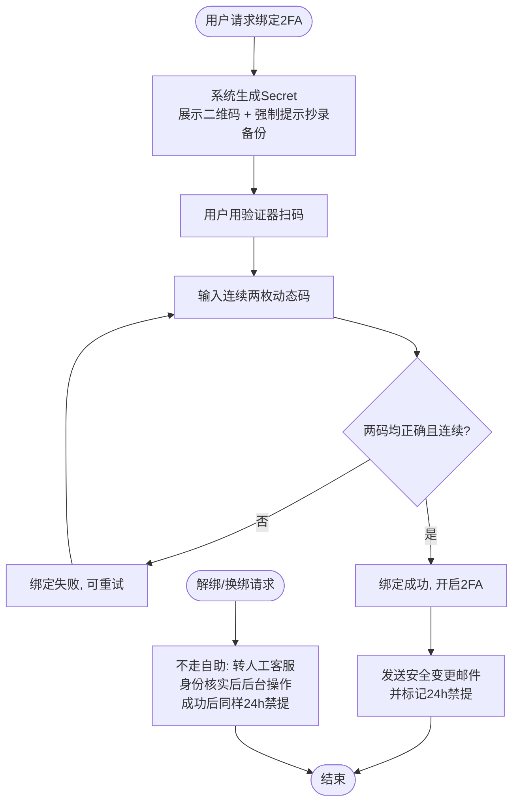
```mermaid
flowchart TD
    S([用户请求绑定2FA]) --> A["系统生成Secret<br/>展示二维码 + 强制提示抄录备份"]
    A --> B["用户用验证器扫码"]
    B --> C["输入连续两枚动态码"]
    C --> D{"两码均正确且连续?"}
    D -->|"否"| X1["绑定失败, 可重试"] --> C
    D -->|"是"| E["绑定成功, 开启2FA"]
    E --> F["发送安全变更邮件<br/>并标记24h禁提"] --> Z([结束])
    T([解绑/换绑请求]) --> U["不走自助: 转人工客服<br/>身份核实后后台操作<br/>成功后同样24h禁提"] --> Z
```

### 1.6 安全项修改流程（以改密码为例，改2FA/白名单同构）

覆盖情况：3.4 表 #3（反劫持总规则）

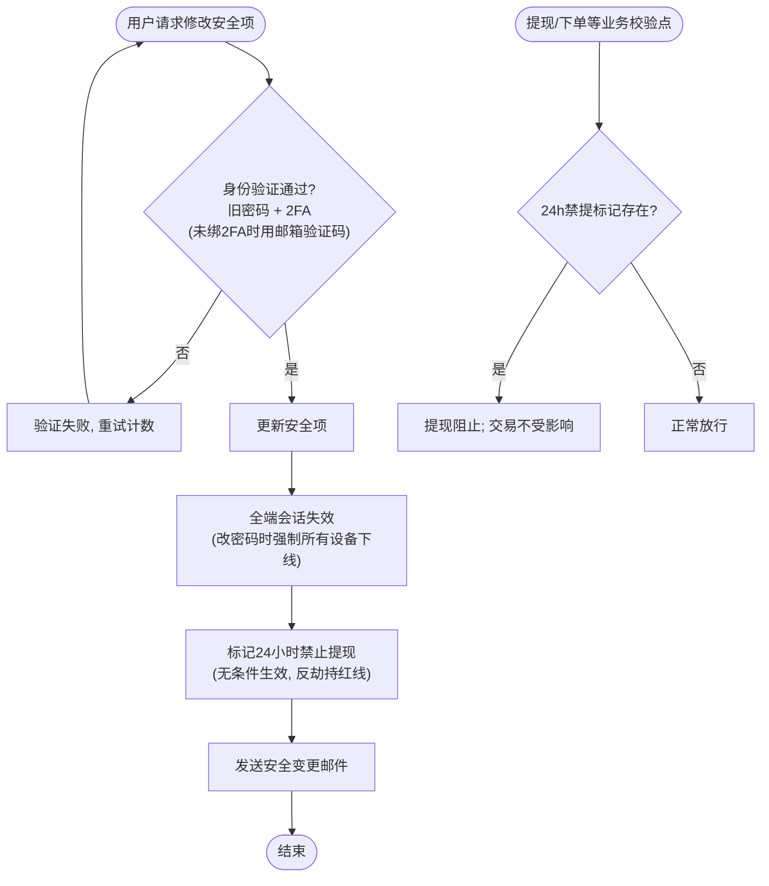
```mermaid
flowchart TD
    S([用户请求修改安全项]) --> A{"身份验证通过?<br/>旧密码 + 2FA<br/>(未绑2FA时用邮箱验证码)"}
    A -->|"否"| X1["验证失败, 重试计数"] --> S
    A -->|"是"| B["更新安全项"]
    B --> C["全端会话失效<br/>(改密码时强制所有设备下线)"]
    C --> D["标记24小时禁止提现<br/>(无条件生效, 反劫持红线)"]
    D --> E["发送安全变更邮件"]
    E --> Z([结束])
    F([提现/下单等业务校验点]) --> G{"24h禁提标记存在?"}
    G -->|"是"| H["提现阻止; 交易不受影响"]
    G -->|"否"| I["正常放行"]
```

---

## 2. 充值

### 2.1 链上充值入账流程（系统侧）

覆盖情况：4 章（MVP文档）表 #1~#7

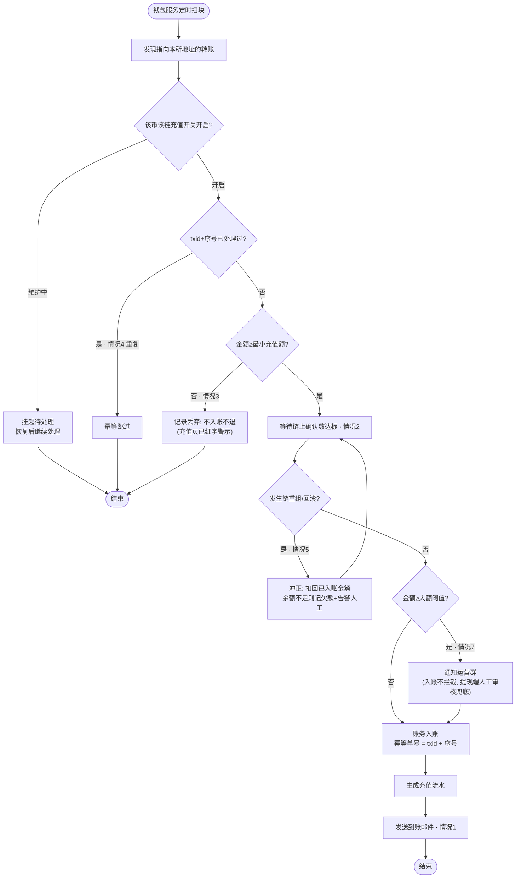
```mermaid
flowchart TD
    S([钱包服务定时扫块]) --> A["发现指向本所地址的转账"]
    A --> B{"该币该链充值开关开启?"}
    B -->|"维护中"| B1["挂起待处理<br/>恢复后继续处理"] --> Z([结束])
    B -->|"开启"| C{"txid+序号已处理过?"}
    C -->|"是 · 情况4 重复"| C1["幂等跳过"] --> Z
    C -->|"否"| D{"金额≥最小充值额?"}
    D -->|"否 · 情况3"| D1["记录丢弃: 不入账不退<br/>(充值页已红字警示)"] --> Z
    D -->|"是"| E["等待链上确认数达标 · 情况2"]
    E --> F{"发生链重组/回滚?"}
    F -->|"是 · 情况5"| F1["冲正: 扣回已入账金额<br/>余额不足则记欠款+告警人工"]
    F1 --> E
    F -->|"否"| G{"金额≥大额阈值?"}
    G -->|"是 · 情况7"| G1["通知运营群<br/>(入账不拦截, 提现端人工审核兜底)"]
    G -->|"否"| H
    G1 --> H["账务入账<br/>幂等单号 = txid + 序号"]
    H --> I["生成充值流水"]
    I --> J["发送到账邮件 · 情况1"]
    J --> Z2([结束])
```

### 2.2 充值错链人工处理流程

覆盖情况：4 章（MVP文档）表 #8

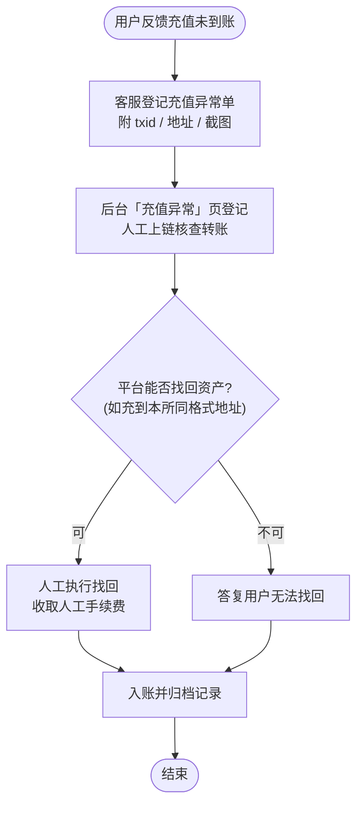
```mermaid
flowchart TD
    S([用户反馈充值未到账]) --> A["客服登记充值异常单<br/>附 txid / 地址 / 截图"]
    A --> B["后台「充值异常」页登记<br/>人工上链核查转账"]
    B --> C{"平台能否找回资产?<br/>(如充到本所同格式地址)"}
    C -->|"可"| D["人工执行找回<br/>收取人工手续费"]
    C -->|"不可"| E["答复用户无法找回"]
    D --> F["入账并归档记录"]
    E --> F
    F --> Z([结束])
```

---

## 3. 现货交易

### 3.1 下单流程

覆盖情况：5.3 表 环节「提交前」#1~#7 + 「撮合中」#11

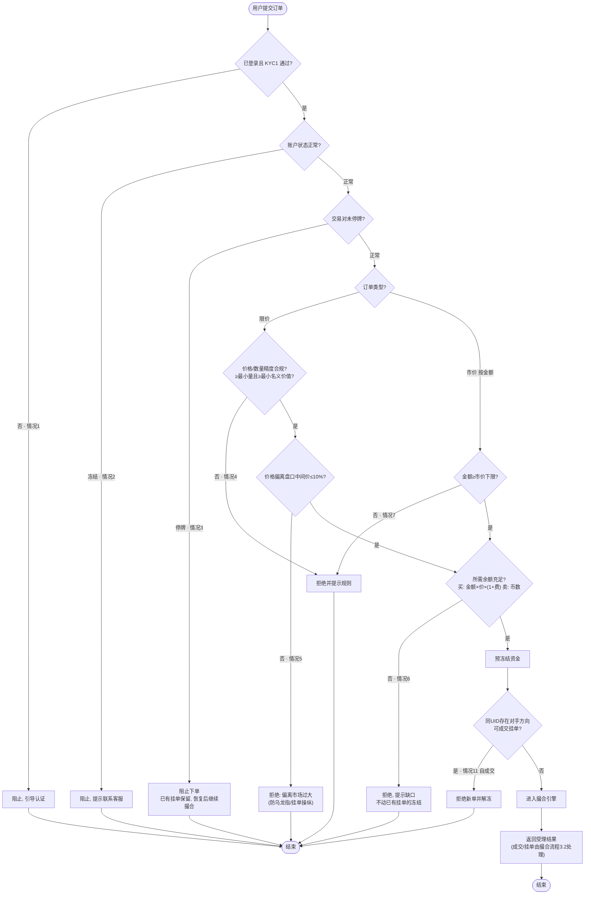
```mermaid
flowchart TD
    S([用户提交订单]) --> A{"已登录且 KYC1 通过?"}
    A -->|"否 · 情况1"| X1["阻止, 引导认证"] --> Z([结束])
    A -->|"是"| B{"账户状态正常?"}
    B -->|"冻结 · 情况2"| X2["阻止, 提示联系客服"] --> Z
    B -->|"正常"| C{"交易对未停牌?"}
    C -->|"停牌 · 情况3"| X3["阻止下单<br/>已有挂单保留, 恢复后继续撮合"] --> Z
    C -->|"正常"| D{"订单类型?"}
    D -->|"限价"| E1{"价格/数量精度合规?<br/>≥最小量且≥最小名义价值?"}
    D -->|"市价 按金额"| E2{"金额≥市价下限?"}
    E1 -->|"否 · 情况4"| X4["拒绝并提示规则"] --> Z
    E2 -->|"否 · 情况7"| X4
    E1 -->|"是"| F{"价格偏离盘口中间价≤10%?"}
    F -->|"否 · 情况5"| X5["拒绝: 偏离市场过大<br/>(防乌龙指/挂单操纵)"] --> Z
    F -->|"是"| G
    E2 -->|"是"| G{"所需余额充足?<br/>买: 金额×价×(1+费) 卖: 币数"}
    G -->|"否 · 情况6"| X6["拒绝, 提示缺口<br/>不动已有挂单的冻结"] --> Z
    G -->|"是"| H["预冻结资金"]
    H --> I{"同UID存在对手方向<br/>可成交挂单?"}
    I -->|"是 · 情况11 自成交"| X7["拒绝新单并解冻"] --> Z
    I -->|"否"| J["进入撮合引擎"]
    J --> K["返回受理结果<br/>(成交/挂单由撮合流程3.2处理)"] --> Z2([结束])
```

### 3.2 撮合流程（限价单 / 市价单分支）

覆盖情况：5.3 表 环节「撮合中」#8~#10、「成交」#12~#13

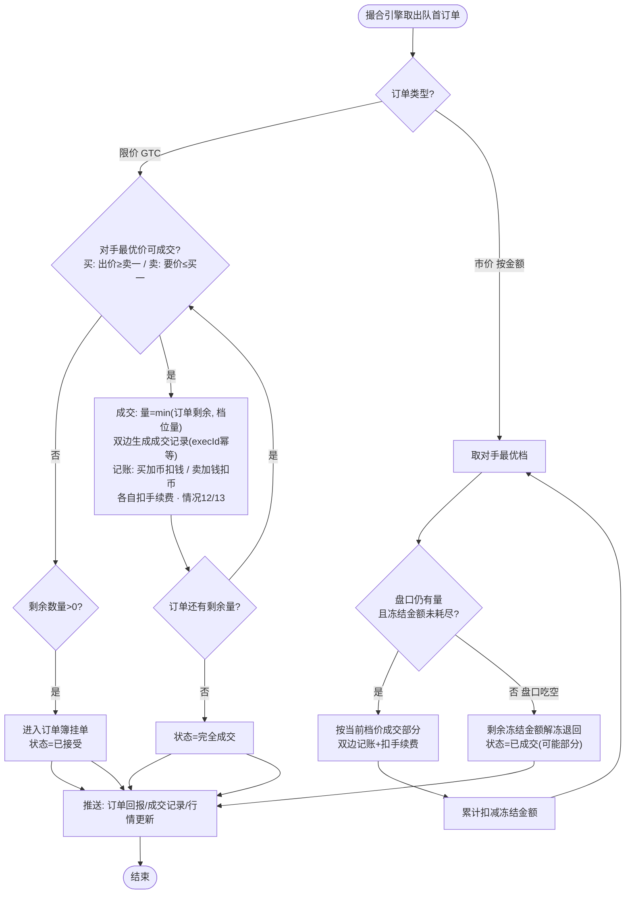
```mermaid
flowchart TD
    S([撮合引擎取出队首订单]) --> A{"订单类型?"}
    A -->|"限价 GTC"| B{"对手最优价可成交?<br/>买: 出价≥卖一 / 卖: 要价≤买一"}
    B -->|"否"| B1{"剩余数量>0?"}
    B1 -->|"是"| B2["进入订单簿挂单<br/>状态=已接受"] --> R
    A -->|"市价 按金额"| P["取对手最优档"]
    P --> Q{"盘口仍有量<br/>且冻结金额未耗尽?"}
    Q -->|"是"| Q1["按当前档价成交部分<br/>双边记账+扣手续费"]
    Q1 --> Q2["累计扣减冻结金额"]
    Q2 --> P
    Q -->|"否 盘口吃空"| Q3["剩余冻结金额解冻退回<br/>状态=已成交(可能部分)"] --> R
    B -->|"是"| C["成交: 量=min(订单剩余, 档位量)<br/>双边生成成交记录(execId幂等)<br/>记账: 买加币扣钱 / 卖加钱扣币<br/>各自扣手续费 · 情况12/13"]
    C --> D{"订单还有剩余量?"}
    D -->|"否"| E["状态=完全成交"] --> R
    D -->|"是"| B
    B2 --> R
    E --> R
    R["推送: 订单回报/成交记录/行情更新"] --> Z([结束])
```

> 记账兜底：任何时刻发现负余额（理论上一期模型不会发生，因先冻结后成交）→ 立即冻结账户 + 告警人工处理（情况14）。

### 3.3 撤单流程

覆盖情况：5.3 表 环节「撤单」#15~#17

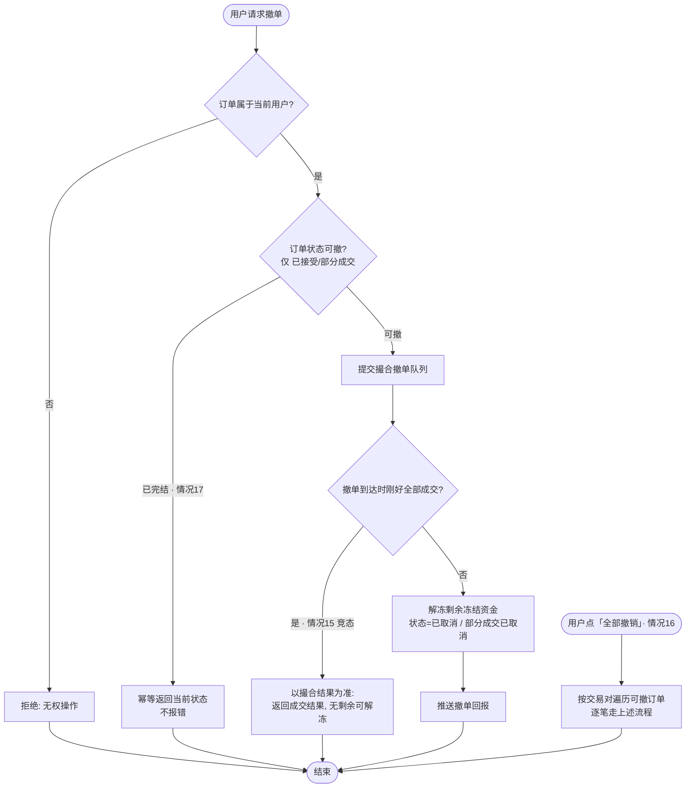
```mermaid
flowchart TD
    S([用户请求撤单]) --> A{"订单属于当前用户?"}
    A -->|"否"| X1["拒绝: 无权操作"] --> Z([结束])
    A -->|"是"| B{"订单状态可撤?<br/>仅 已接受/部分成交"}
    B -->|"已完结 · 情况17"| B1["幂等返回当前状态<br/>不报错"] --> Z
    B -->|"可撤"| C["提交撮合撤单队列"]
    C --> D{"撤单到达时刚好全部成交?"}
    D -->|"是 · 情况15 竞态"| E["以撮合结果为准:<br/>返回成交结果, 无剩余可解冻"] --> Z
    D -->|"否"| F["解冻剩余冻结资金<br/>状态=已取消 / 部分成交已取消"]
    F --> G["推送撤单回报"] --> Z
    T([用户点「全部撤销」· 情况16]) --> U["按交易对遍历可撤订单<br/>逐笔走上述流程"] --> Z
```

### 3.4 行情生成与推送流程

覆盖情况：5.4 表 #1~#5

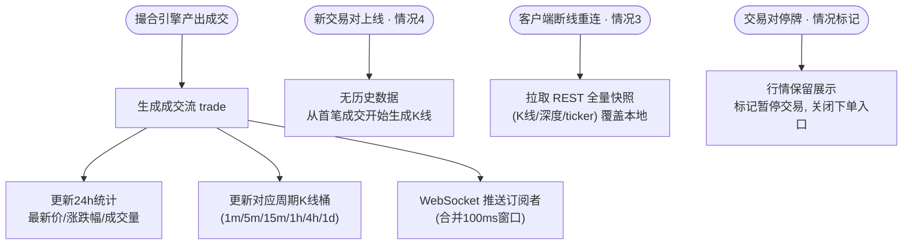
```mermaid
flowchart TD
    S([撮合引擎产出成交]) --> A["生成成交流 trade"]
    A --> B["更新24h统计<br/>最新价/涨跌幅/成交量"]
    A --> C["更新对应周期K线桶<br/>(1m/5m/15m/1h/4h/1d)"]
    A --> D["WebSocket 推送订阅者<br/>(合并100ms窗口)"]
    T([新交易对上线 · 情况4]) --> U["无历史数据<br/>从首笔成交开始生成K线"]
    V([客户端断线重连 · 情况3]) --> W["拉取 REST 全量快照<br/>(K线/深度/ticker) 覆盖本地"]
    X([交易对停牌 · 情况标记]) --> Y["行情保留展示<br/>标记暂停交易, 关闭下单入口"]
```

---

## 4. 提现

### 4.1 用户提现申请流程

覆盖情况：6 章（MVP文档）表 #1~#8、#12

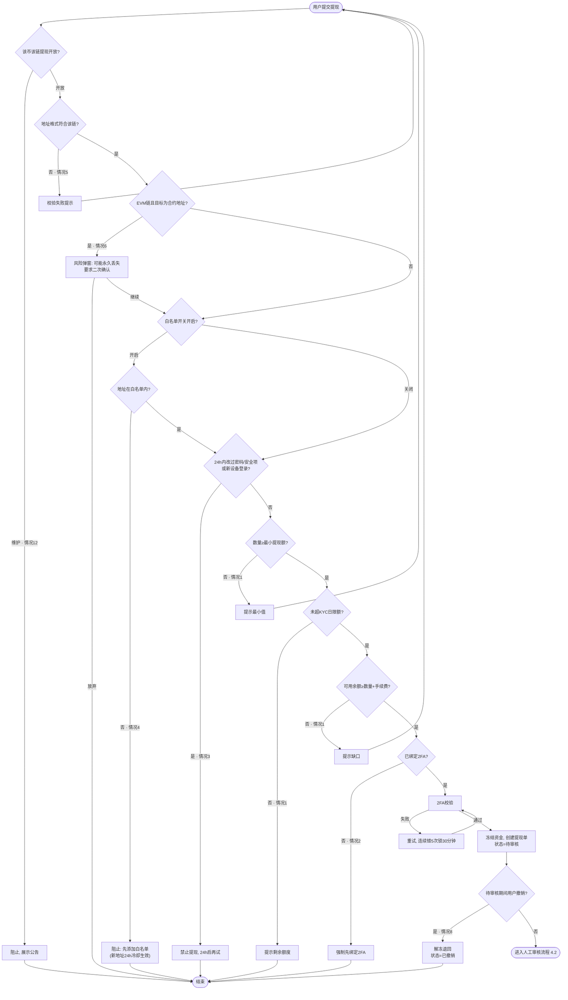
```mermaid
flowchart TD
    S([用户提交提现]) --> A{"该币该链提现开放?"}
    A -->|"维护 · 情况12"| X1["阻止, 展示公告"] --> Z([结束])
    A -->|"开放"| B{"地址格式符合该链?"}
    B -->|"否 · 情况5"| X2["校验失败提示"] --> S
    B -->|"是"| C{"EVM链且目标为合约地址?"}
    C -->|"是 · 情况6"| C1["风险弹窗: 可能永久丢失<br/>要求二次确认"]
    C1 -->|"放弃"| Z
    C1 -->|"继续"| D
    C -->|"否"| D{"白名单开关开启?"}
    D -->|"开启"| E{"地址在白名单内?"}
    E -->|"否 · 情况4"| X3["阻止: 先添加白名单<br/>(新地址24h冷却生效)"] --> Z
    E -->|"是"| F
    D -->|"关闭"| F{"24h内改过密码/安全项<br/>或新设备登录?"}
    F -->|"是 · 情况3"| X4["禁止提现, 24h后再试"] --> Z
    F -->|"否"| G{"数量≥最小提现额?"}
    G -->|"否 · 情况1"| X5["提示最小值"] --> S
    G -->|"是"| H{"未超KYC日限额?"}
    H -->|"否 · 情况1"| X6["提示剩余额度"] --> Z
    H -->|"是"| I{"可用余额≥数量+手续费?"}
    I -->|"否 · 情况1"| X7["提示缺口"] --> S
    I -->|"是"| J{"已绑定2FA?"}
    J -->|"否 · 情况2"| X8["强制先绑定2FA"] --> Z
    J -->|"是"| K["2FA校验"]
    K -->|"失败"| K1["重试, 连续错5次锁30分钟"] --> K
    K -->|"通过"| L["冻结资金, 创建提现单<br/>状态=待审核"]
    L --> M{"待审核期间用户撤销?"}
    M -->|"是 · 情况8"| M1["解冻退回<br/>状态=已撤销"] --> Z
    M -->|"否"| N([进入人工审核流程 4.2])
```

### 4.2 提现人工审核与打款流程（审核员侧）

覆盖情况：6 章（MVP文档）表 #7、#9~#11、#14

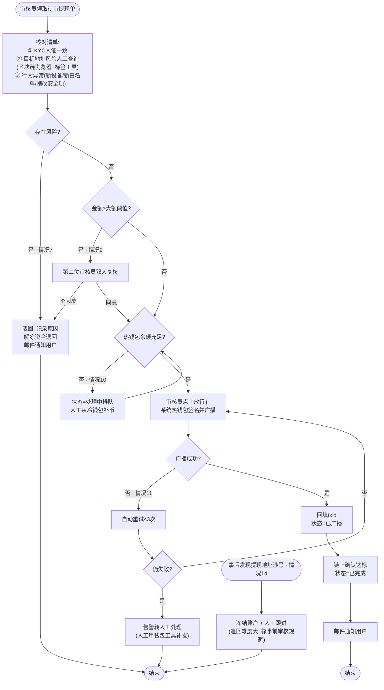
```mermaid
flowchart TD
    S([审核员领取待审提现单]) --> A["核对清单:<br/>① KYC人证一致<br/>② 目标地址风险人工查询<br/>(区块链浏览器+标签工具)<br/>③ 行为异常(新设备/新白名单/刚改安全项)"]
    A --> B{"存在风险?"}
    B -->|"是 · 情况7"| X1["驳回: 记录原因<br/>解冻资金退回<br/>邮件通知用户"] --> Z([结束])
    B -->|"否"| C{"金额≥大额阈值?"}
    C -->|"是 · 情况9"| D["第二位审核员双人复核"]
    D -->|"不同意"| X1
    D -->|"同意"| E
    C -->|"否"| E{"热钱包余额充足?"}
    E -->|"否 · 情况10"| E1["状态=处理中排队<br/>人工从冷钱包补币"] --> E
    E -->|"是"| F["审核员点「放行」<br/>系统热钱包签名并广播"]
    F --> G{"广播成功?"}
    G -->|"否 · 情况11"| G1["自动重试≤3次"]
    G1 --> G2{"仍失败?"}
    G2 -->|"是"| G3["告警转人工处理<br/>(人工用钱包工具补发)"] --> Z
    G2 -->|"否"| F
    G -->|"是"| H["回填txid<br/>状态=已广播"]
    H --> I["链上确认达标<br/>状态=已完成"]
    I --> J["邮件通知用户"] --> Z2([结束])
    T([事后发现提现地址涉黑 · 情况14]) --> K["冻结账户 + 人工跟进<br/>(追回难度大, 靠事前审核规避)"] --> Z
```

---

## 5. 记账与对账

### 5.1 账务统一入口流程（所有资金变动必经）

覆盖情况：7 章（MVP文档）规则 #1~#3

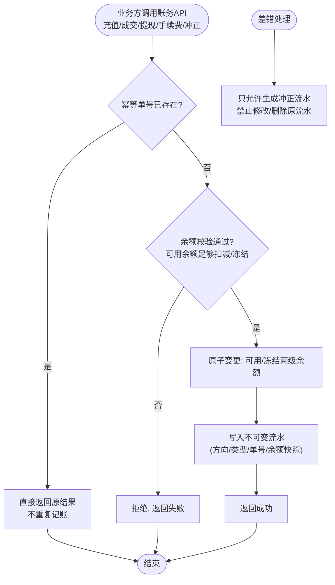
```mermaid
flowchart TD
    S([业务方调用账务API<br/>充值/成交/提现/手续费/冲正]) --> A{"幂等单号已存在?"}
    A -->|"是"| A1["直接返回原结果<br/>不重复记账"] --> Z([结束])
    A -->|"否"| B{"余额校验通过?<br/>可用余额足够扣减/冻结"}
    B -->|"否"| B1["拒绝, 返回失败"] --> Z
    B -->|"是"| C["原子变更: 可用/冻结两级余额"]
    C --> D["写入不可变流水<br/>(方向/类型/单号/余额快照)"]
    D --> E["返回成功"] --> Z
    F([差错处理]) --> G["只允许生成冲正流水<br/>禁止修改/删除原流水"]
```

### 5.2 日终对账流程

覆盖情况：7 章（MVP文档）规则 #4~#5

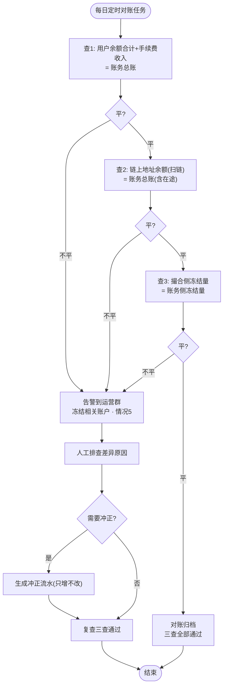
```mermaid
flowchart TD
    S([每日定时对账任务]) --> A["查1: 用户余额合计+手续费收入<br/>= 账务总账"]
    A --> B{"平?"}
    B -->|"不平"| Y["告警到运营群<br/>冻结相关账户 · 情况5"]
    B -->|"平"| C["查2: 链上地址余额(扫链)<br/>= 账务总账(含在途)"]
    C --> D{"平?"}
    D -->|"不平"| Y
    D -->|"平"| E["查3: 撮合侧冻结量<br/>= 账务侧冻结量"]
    E --> F{"平?"}
    F -->|"不平"| Y
    F -->|"平"| G["对账归档<br/>三查全部通过"] --> Z([结束])
    Y --> M["人工排查差异原因"]
    M --> N{"需要冲正?"}
    N -->|"是"| O["生成冲正流水(只增不改)"]
    N -->|"否"| P
    O --> P["复查三查通过"]
    P --> Z
```

---

## 6. Admin 后台

### 6.1 后台操作与审计通用流程

覆盖情况：8 章（MVP文档）

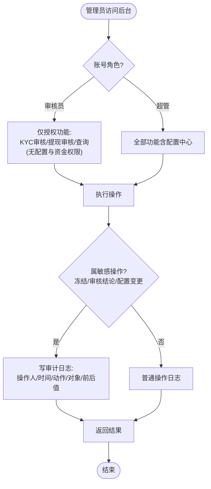
```mermaid
flowchart TD
    S([管理员访问后台]) --> A{"账号角色?"}
    A -->|"审核员"| B["仅授权功能:<br/>KYC审核/提现审核/查询<br/>(无配置与资金权限)"]
    A -->|"超管"| C["全部功能含配置中心"]
    B --> D["执行操作"]
    C --> D
    D --> E{"属敏感操作?<br/>冻结/审核结论/配置变更"}
    E -->|"是"| F["写审计日志:<br/>操作人/时间/动作/对象/前后值"]
    E -->|"否"| G["普通操作日志"]
    F --> H["返回结果"]
    G --> H
    H --> Z([结束])
```

### 6.2 交易对配置流程（上架/停牌）

覆盖情况：8 章（MVP文档）配置中心 + 3.1 下单前置

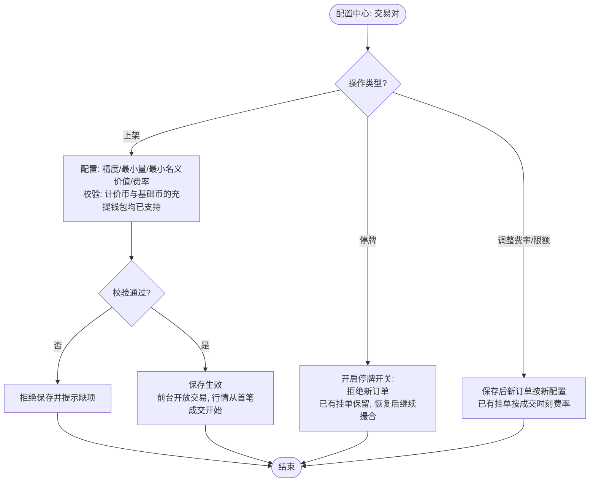
```mermaid
flowchart TD
    S([配置中心: 交易对]) --> A{"操作类型?"}
    A -->|"上架"| B["配置: 精度/最小量/最小名义价值/费率<br/>校验: 计价币与基础币的充提钱包均已支持"]
    B --> C{"校验通过?"}
    C -->|"否"| X1["拒绝保存并提示缺项"] --> Z([结束])
    C -->|"是"| D["保存生效<br/>前台开放交易, 行情从首笔成交开始"]
    A -->|"停牌"| E["开启停牌开关:<br/>拒绝新订单<br/>已有挂单保留, 恢复后继续撮合"]
    A -->|"调整费率/限额"| F["保存后新订单按新配置<br/>已有挂单按成交时刻费率"]
    D --> Z
    E --> Z
    F --> Z
```

---

## 7. 邮件通知

### 7.1 邮件发送流程

覆盖情况：9 章（MVP文档）

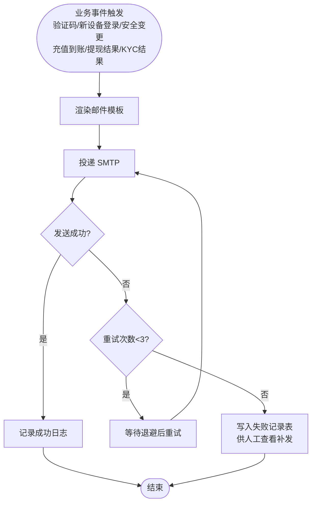
```mermaid
flowchart TD
    S([业务事件触发<br/>验证码/新设备登录/安全变更<br/>充值到账/提现结果/KYC结果]) --> A["渲染邮件模板"]
    A --> B["投递 SMTP"]
    B --> C{"发送成功?"}
    C -->|"是"| D["记录成功日志"] --> Z([结束])
    C -->|"否"| E{"重试次数<3?"}
    E -->|"是"| F["等待退避后重试"] --> B
    E -->|"否"| G["写入失败记录表<br/>供人工查看补发"] --> Z
```

---

## 附：流程图与功能对照索引

| 功能 | 流程图 | 覆盖情况来源 |
|------|--------|-------------|
| 注册 | 1.1 | MVP文档 3.1 表 #1~#6 |
| 登录 | 1.2 | 3.2 表 #1~#7 |
| 忘记密码 | 1.3 | 3.2 表 #4 |
| KYC | 1.4 | 3.3 表 #1~#8 |
| 2FA 绑定 | 1.5 | 3.4 表 #1 |
| 安全项修改/24h禁提 | 1.6 | 3.4 表 #3 |
| 充值入账 | 2.1 | 第4章表 #1~#7 |
| 充值错链处理 | 2.2 | 第4章表 #8 |
| 现货下单 | 3.1 | 5.3 表 提交前+自成交 |
| 撮合 | 3.2 | 5.3 表 撮合中+成交 |
| 撤单 | 3.3 | 5.3 表 撤单 |
| 行情 | 3.4 | 5.4 表 |
| 提现申请 | 4.1 | 第6章表 #1~#8,#12 |
| 提现审核打款 | 4.2 | 第6章表 #7,#9~#11,#14 |
| 账务入口 | 5.1 | 第7章规则 #1~#3 |
| 日终对账 | 5.2 | 第7章规则 #4~#5 |
| 后台审计 | 6.1 | 第8章 |
| 交易对配置 | 6.2 | 第8章 |
| 邮件通知 | 7.1 | 第9章 |

