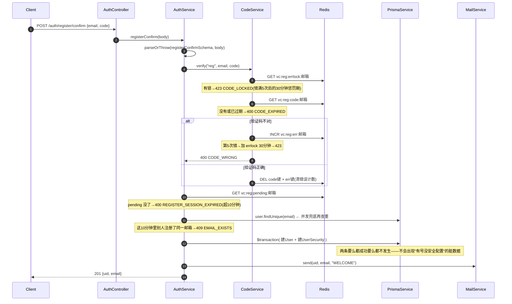
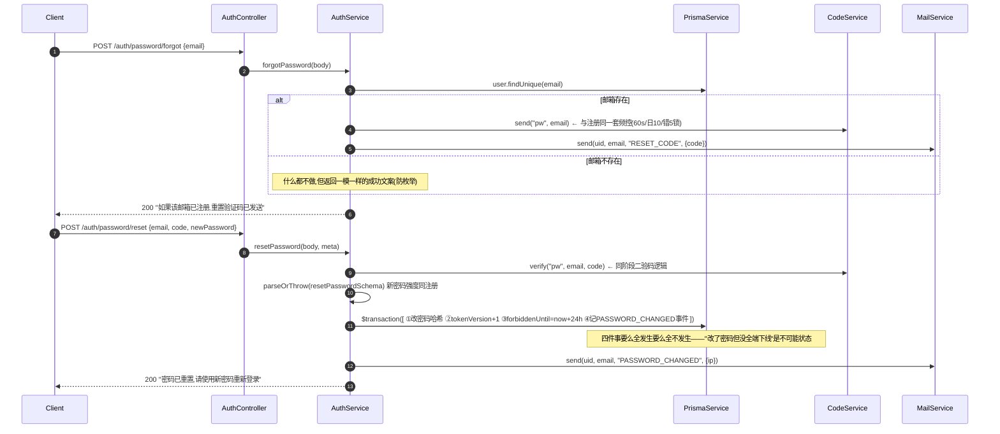
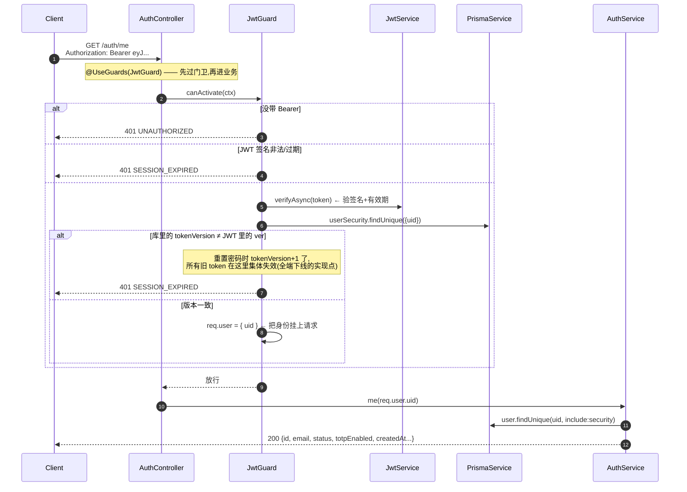
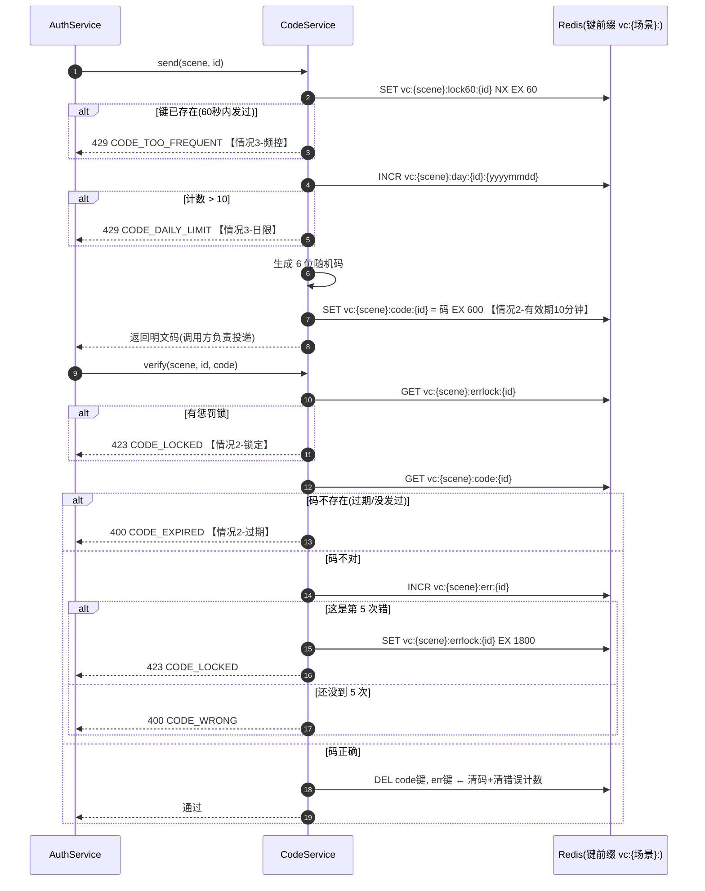
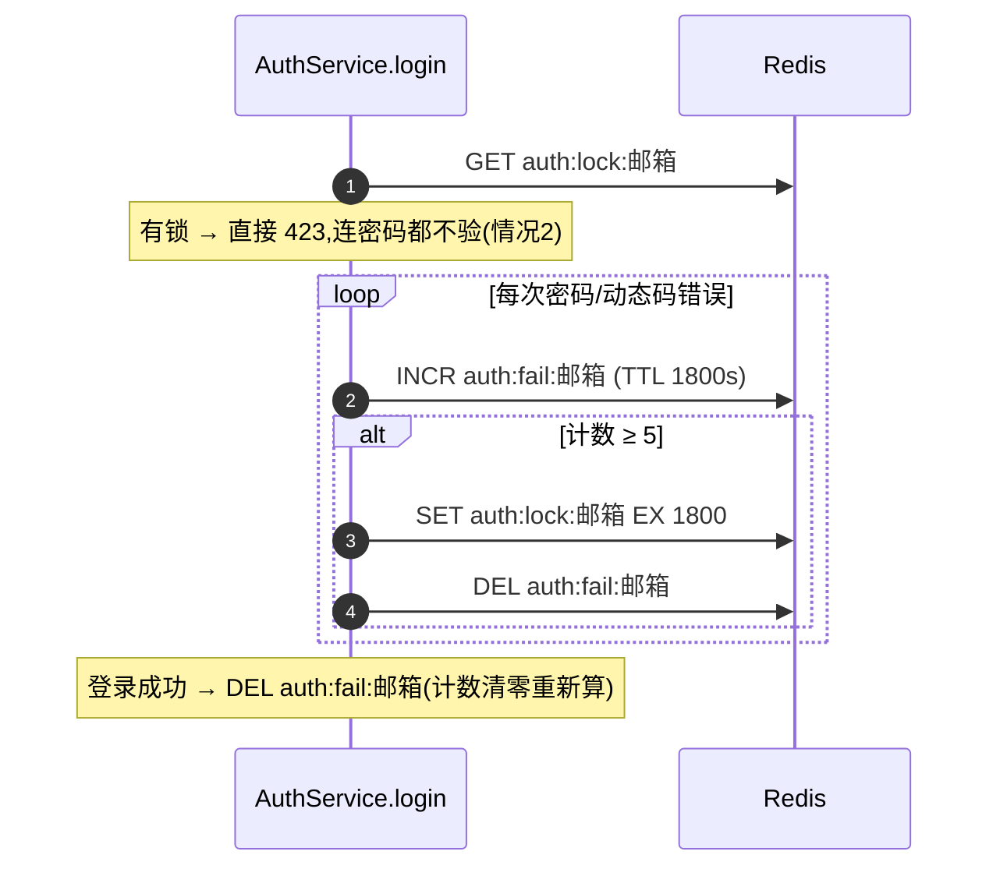

# 实际开发图 · 函数调用时序图

> **定位**：回答「请求进来后，代码里谁调用谁、每个函数干什么」。图按 M1-T2 鉴权的真实代码绘制（文件均为 `apps/api/src/` 下真实路径），后续任务完成一个补一张。
> **怎么读**：实线箭头 `->>` = 调用，虚线箭头 `-->>` = 返回；`alt/else` = 分支（条件满足走哪条）；`opt` = 可能不发生的可选步骤。看不懂某一步时，去 §8 的函数索引表查它的职责，再对照源文件看实现。

---

## 0. 参与角色（时序图里的"泳道"都是谁）

| 泳道 | 是什么 | 所在文件 |
|---|---|---|
| **Client** | 调用方（浏览器/curl），本图就是你的 curl 命令 | — |
| **AuthController** | 路由层：把 HTTP 请求分发给对应方法，只做「收参数→调服务→返回结果」 | `src/auth/auth.controller.ts` |
| **AuthService** | 业务层：全部业务判断都在这里 | `src/auth/auth.service.ts` |
| **CodeService** | 验证码专家：发码、验码、频控、错误锁定 | `src/auth/code.service.ts` |
| **Redis** | 验证码/频控/锁定的存储（通过 `RedisCodeStore` 读写） | `src/redis.service.ts` |
| **PrismaService** | 数据库翻译官：把代码操作变成 MySQL 语句 | `src/prisma.service.ts` |
| **MailService** | 邮件 outbox：往 MailLog 表插一行（M1 不真发） | `src/auth/mail.service.ts` |
| **JwtService / JwtGuard** | 签发 JWT / 校验 JWT 的门卫 | `@nestjs/jwt` + `src/auth/jwt.guard.ts` |
| **parseOrThrow** | 参数校验官：zod 校验不过直接 400 | `src/zod.util.ts` |

---

## 1. 注册阶段一：POST /auth/register/init

> 触发：`curl -X POST localhost:4000/auth/register/init -d '{"email":"t1@test.local","password":"Abcd1234"}'`
> 作用：校验参数与资格 → 发验证码 → 把「密码哈希+邀请人」暂存 Redis，等阶段二确认。

```mermaid
sequenceDiagram
    autonumber
    Client->>AuthController: POST /auth/register/init
    Note over AuthController: registerInit(body, req) —— 只转发,不写业务
    AuthController->>AuthController: metaOf(req)<br/>从请求头提取 ip / userAgent / region
    AuthController->>AuthService: registerInit(body, meta)

    AuthService->>AuthService: parseOrThrow(registerSchema, body)<br/>邮箱格式、密码强度(≥8位含字母数字) 不过→400
    AuthService->>AuthService: 读环境变量 REGION_BLACKLIST<br/>黑名单含该地区→403 REGION_NOT_SUPPORTED

    AuthService->>PrismaService: user.findUnique({ where:{email} })
    PrismaService-->>AuthService: 已存在? alt 已存在→409 EMAIL_EXISTS(情况1)

    opt 带了邀请码(情况6)
        AuthService->>PrismaService: user.findUnique({ where:{id:邀请码} })
        PrismaService-->>AuthService: 邀请人不存在→invitedBy=null(不阻断注册)
    end

    AuthService->>CodeService: send("reg", email)
    CodeService->>Redis: SET vc:reg:lock60:邮箱 NX EX 60
    Note over CodeService: 键已存在→429 CODE_TOO_FREQUENT(60秒只能发一次)
    CodeService->>Redis: INCR vc:reg:day:邮箱:日期 (首次设 86400s 过期)
    Note over CodeService: 计数>10→429 CODE_DAILY_LIMIT(每天最多10条)
    CodeService-->>AuthService: 返回 6 位随机验证码

    AuthService->>MailService: send(null, email, "REGISTER_CODE", {code})
    MailService->>PrismaService: mailLog.create(...) ← 邮件落 outbox 表,不真发

    AuthService->>Redis: SET vc:reg:pending:邮箱 = {bcrypt密码哈希, invitedBy, region} EX 600
    Note over AuthService: 密码此刻已哈希,明文不落任何存储;pending 600秒后自动过期

    AuthService-->>AuthController: { message: "验证码已发送..." }
    AuthController-->>Client: 201
```

## 2. 注册阶段二：POST /auth/register/confirm

> 触发：带上阶段一 MailLog 里的验证码。
> 作用：验码 → 建号（一个事务里同时建 User 和 UserSecurity）。



## 3. 登录：POST /auth/login（含 2FA 与新设备检测）

> 触发：`curl -X POST localhost:4000/auth/login -d '{"email":"...","password":"..."}'`
> 作用：验密码 → 各安全分支 → 记登录日志 → 签发 JWT。分支顺序即安全优先级：先挡「锁定的」，再验「密码」，再看「账号状态」，再验「动态码」，最后处理「新设备」。

```mermaid
sequenceDiagram
    autonumber
    Client->>AuthController: POST /auth/login {email, password, totpCode?}
    AuthController->>AuthService: login(body, meta)

    AuthService->>Redis: GET auth:lock:邮箱
    Note over AuthService: 有锁→423 LOGIN_LOCKED(就算密码对也拒,情况2)

    AuthService->>PrismaService: user.findUnique(email, include:security)
    AuthService->>AuthService: bcrypt.compare(明文, 库里的哈希)
    alt 用户不存在 或 密码不对
        AuthService->>Redis: INCR auth:fail:邮箱
        Note over AuthService: 第5次→SET auth:lock:邮箱 30分钟(情况2)
        AuthService-->>Client: 401 INVALID_CREDENTIALS<br/>邮箱不存在也是同一句文案(防撞库)
    end
    Note over AuthService: 账号 FROZEN/DISABLED→403 ACCOUNT_FROZEN(情况6)

    opt 开了 2FA(UserSecurity.totpEnabled=true)
        AuthService-->>Client: 没带 totpCode→401 TOTP_REQUIRED
        AuthService->>AuthService: totpVerify(密钥, 动态码)<br/>±30秒窗口内比对,错→计数并 401 TOTP_WRONG
    end

    AuthService->>PrismaService: securityEvent.findFirst(uid, type∈[LOGIN,NEW_DEVICE], ip, userAgent)
    Note over AuthService: 历史上出现过这个 IP+浏览器组合=老设备
    AuthService->>PrismaService: securityEvent.create(type=LOGIN) ← 每次登录都记
    opt 是新设备(情况3)
        AuthService->>PrismaService: securityEvent.create(type=NEW_DEVICE)
        AuthService->>MailService: send(uid, email, "NEW_DEVICE", {ip})
        Note over MailService: 邮件落 outbox:"你的账号在新设备登录了"
    end

    AuthService->>Redis: DEL auth:fail:邮箱 ← 登录成功清零失败计数
    AuthService->>JwtService: signAsync({ sub: uid, ver: tokenVersion })
    Note over JwtService: 签出 7 天有效的 JWT;ver 是会话版本号,重置密码后会变
    AuthService-->>Client: 200 { token, user:{id, email} }
```

## 4. 忘记密码：POST /auth/password/forgot + /auth/password/reset

> 作用：防枚举（不暴露哪些邮箱注册过）；重置成功 = 新密码 + 全端下线 + 24h 禁提。



## 5. JWT 鉴权：GET /auth/me（所有受保护接口的门）

> 作用：证明「你是你」。别的业务接口（下单/查资产…）挂上 `@UseGuards(JwtGuard)` 就自动受保护。



## 6. 验证码服务内部：send / verify 的完整规则

> 注册用场景 `reg`、重置密码用场景 `pw`，规则完全相同，只是 Redis 键前缀不同。这张图就是流程图 1.1「情况1~6」的代码版。



## 7. 登录失败锁定（与验证码锁定是两套独立计数）

> 登录失败计数在 `auth:fail:邮箱` / `auth:lock:邮箱`，和验证码的 `vc:*` 互不影响——账号被锁不等于验证码被锁。



## 8. 函数索引表（每个函数是干什么的、被谁调用）

| 函数/方法 | 所在文件 | 一句话职责 | 被谁调用 |
|---|---|---|---|
| `registerInit(body, meta)` | auth/auth.service.ts | 注册阶段一：校验→查重→发码→暂存 pending | AuthController.registerInit |
| `registerConfirm(body)` | auth/auth.service.ts | 注册阶段二：验码→事务建号→欢迎邮件 | AuthController.registerConfirm |
| `login(body, meta)` | auth/auth.service.ts | 登录全部分支→记日志→签发 JWT | AuthController.login |
| `forgotPassword(body)` | auth/auth.service.ts | 防枚举发重置码 | AuthController.forgotPassword |
| `resetPassword(body, meta)` | auth/auth.service.ts | 重置密码+全端下线+24h禁提 | AuthController.resetPassword |
| `me(uid)` | auth/auth.service.ts | 返回当前登录用户信息 | AuthController.me（已过 JwtGuard） |
| `bumpFail(id)`（私有） | auth/auth.service.ts | 登录失败计数，第 5 次触发 30 分钟锁定 | login 内部（密码错/TOTP 错两处） |
| `send(scene, id)` | auth/code.service.ts | 发码：60s 频控→日限 10→生成存 600s | registerInit / forgotPassword |
| `verify(scene, id, code)` | auth/code.service.ts | 验码：锁定→过期→计数→比对→清态 | registerConfirm / resetPassword |
| `RedisCodeStore.get/setEx/incr/setNxEx/del` | auth/code.service.ts | CodeStore 接口的 Redis 实现（incr 首次设 TTL） | CodeService、AuthService（pending/失败计数） |
| `send(uid, to, type, payload)` | auth/mail.service.ts | 邮件 outbox：插一条 MailLog（M1 不真发） | 各业务节点（REGISTER_CODE/NEW_DEVICE/…） |
| `canActivate(ctx)` | auth/jwt.guard.ts | 验 JWT+比对 tokenVersion→挂 req.user | 所有挂 `@UseGuards(JwtGuard)` 的接口 |
| `signAsync(payload)` | @nestjs/jwt 库 | 签发 7 天 JWT `{sub, ver}` | login |
| `verifyAsync(token)` | @nestjs/jwt 库 | 验签+解出载荷 | JwtGuard |
| `totpAt(secret, unixSec)` | auth/totp.ts | 算某时刻的 6 位动态码（HMAC-SHA1 截断） | totpVerify |
| `totpVerify(secret, code)` | auth/totp.ts | ±30 秒窗口内比对动态码 | login 的 2FA 分支 |
| `totpGenerateSecret()` | auth/totp.ts | 生成 base32 密钥（绑 2FA 时用） | 预留：M2 绑定 2FA 接口 |
| `base32Decode/Encode` | auth/totp.ts | 密钥文本编码 | totp 内部 |
| `apiError(status, code, msg)` | auth/errors.ts | 抛统一业务异常（HTTP 码+业务码+中文） | 全模块所有报错点 |
| `parseOrThrow(schema, data)` | zod.util.ts | zod 校验，不过→400 VALIDATION | 每个 service 方法开头 |
| `metaOf(req)`（私有） | auth/auth.controller.ts | 从请求头提取 ip/userAgent/region | 每个 controller 方法 |

> **数据表速查**：`User`(账号) / `UserSecurity`(tokenVersion、totp、禁提) / `SecurityEvent`(登录日志) / `MailLog`(邮件 outbox) —— 建表语句见 `packages/db/prisma/schema.prisma`。
