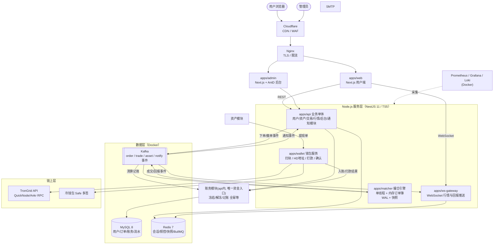
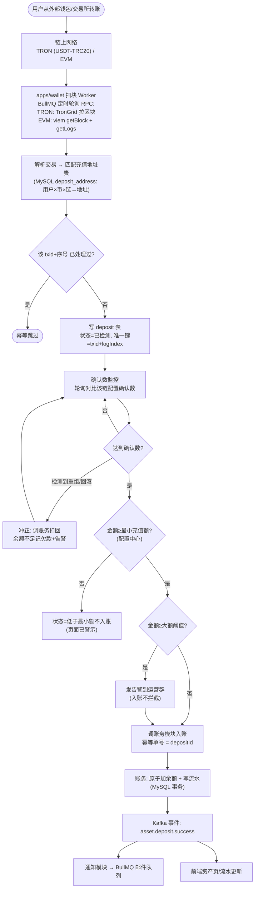
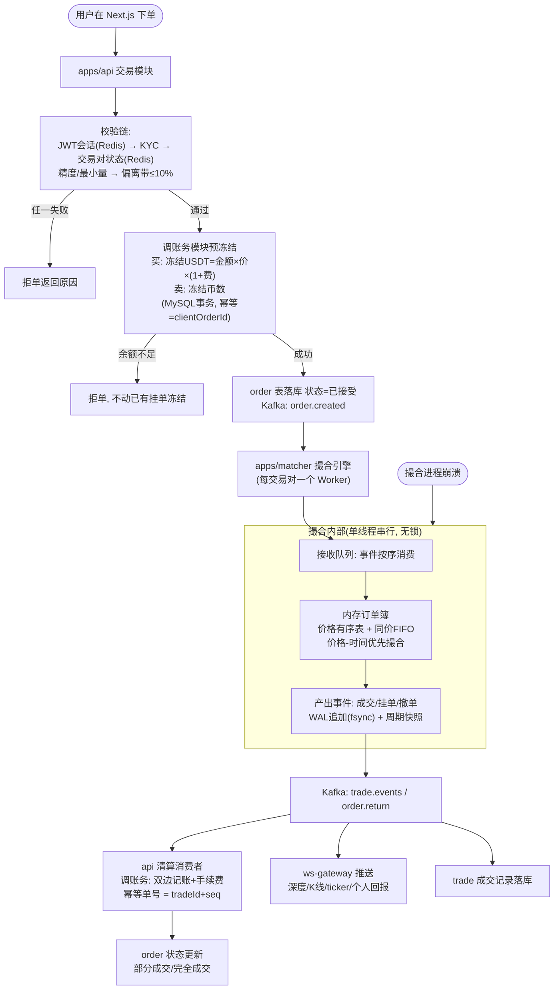
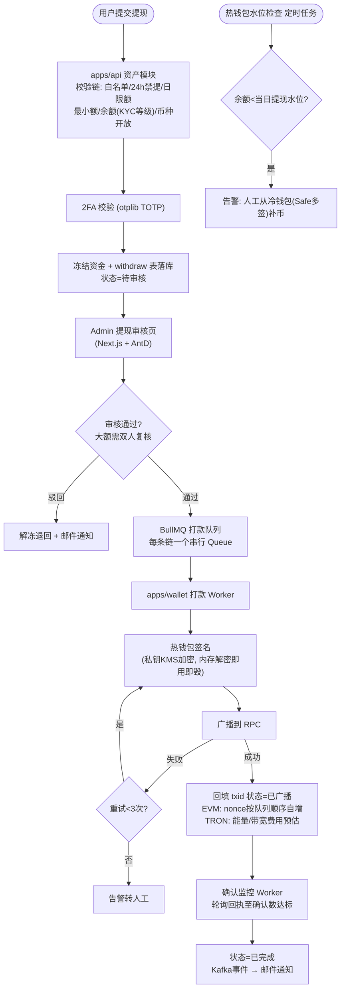

# 技术决策方案：技术选型与核心链路架构

> **定位**：回答两个问题——① 这个交易所总共需要哪些技术；② 用户「入金（充值）→ 买币（现货交易）→ 出金（提现）」在技术上如何处理。
>
> **配套文档**：《[交易所MVP-做与不做及最小流程.md](交易所MVP-做与不做及最小流程.md)》（功能范围）、《[MVP功能程序流程图.md](MVP功能程序流程图.md)》（业务流程）——本文档是这些流程的**技术实现方案**。
>
> **选型三原则**：
> 1. **主流 + 好找工作**：TypeScript / Next.js / NestJS / MySQL / Redis / Kafka / Docker / K8s——全部是当前招聘市场职位量 Top 级技能；尤其「TypeScript 全栈」是近三年需求增长最快、最好招人的组合，前端后端一个人可兼修，团队互补性强。
> 2. **结合本机实际**（2026-09-13 实测，见 1.1）：本机已装 Node 22 LTS + pnpm + Docker，未装 Java/Go；链上库生态 JS 最强。因此**全栈 TypeScript，不引入 Java**。
> 3. **架构跟随里程碑演进**：MVP 为「模块化单体 + 3 个独立进程」（撮合、钱包、WS 网关），不搞微服务全家桶；边界按可拆分设计，M3 后按需拆分并上 K8s。

---

## 1. 本机环境与选型依据

### 1.1 开发机实测结果（2026-09-13）

| 项 | 实测 | 对选型的意义 |
|----|------|-------------|
| CPU | i9-10900K，20 线程 | 撮合、扫块、Kafka 全部本机并行开发无压力 |
| 内存 | 62GB（空闲 60GB） | MySQL + Redis + Kafka（KRaft）+ 全部服务同时跑，占用 < 10GB |
| 磁盘 | 949GB 可用 | 充足 |
| Node.js | **v22.23.2（LTS，nvm 管理）** | ✅ 现成的主力运行时 |
| pnpm | 9.15.0 | ✅ monorepo 包管理现成 |
| Docker | 29.8.0 | ✅ MySQL/Redis/Kafka 用容器起，不污染系统 |
| Python | 3.12.3 | 可写对账/运维脚本 |
| Java / Go / Rust | 未安装 | ❌ 不选 Java 的直接依据之一：需从零装 JDK+构建链，且链上库生态不如 JS |
| MySQL / Redis / nginx | 未安装 | 全部走 Docker 容器，开发/生产同构 |

**结论**：这台机器是一台现成的 **Node.js/TypeScript 全栈开发机**，选 TS 全栈可以「零安装」直接开工（基础设施全部 Docker 化）。

### 1.2 为什么是 TypeScript 全栈（而不是 Java / Go）

| 维度 | TypeScript 全栈 ✅ | Java | Go |
|------|------------------|------|-----|
| 本机就绪 | ✅ 已装 node22+pnpm | 需装 JDK/Maven | 需装 Go |
| 好找工作 | ✅ TS 全栈需求增长最快；前端/后端岗位都覆盖 | 多，但业务 Java 池趋于饱和 | 岗位多但偏基础架构，中小团队招全栈 Go 难 |
| 链上生态 | ✅ **最强**：ethers.js/viem（EVM）、tronWeb（TRON）都是 JS 原生库 | web3j/trident 较弱 | go-ethereum 强但 TRON 弱 |
| 撮合性能 | ✅ MVP 规模足够：单线程事件循环**天然串行无锁**，本机实测能力数千 TPS | 强 | 强 |
| 一门语言全栈 | ✅ 前端/后端/脚本同语言，类型定义共享 | 前端仍需 TS | 前端仍需 TS |

> 备选保留：M4+ 若撮合需要极致性能/多核扩展，撮合进程可用 Rust/Go 重写（接口不变，见 ADR-4）。

---

## 2. 技术栈总表（选什么、为什么）

### 2.1 前端

| 项 | 选型 | 版本 | 备选 | 理由 |
|----|------|------|------|------|
| 框架 | **Next.js（App Router）** | 15+ | — | 应要求选用：后续要 SEO/营销页/国际化/i18n 路由/Server Components 扩展时不用换框架；React 生态就业面最大 |
| 语言 | TypeScript | 5.x | — | 全栈统一语言 |
| UI 组件库 | Ant Design | 5.x | shadcn/ui | 交易所页面（资产/订单表格密集）+ Admin 后台效率最高 |
| 行情图表 | TradingView lightweight-charts | 5.x | klinecharts | 交易所事实标准 |
| 实时行情 | 原生 WebSocket + 重连快照对齐 | — | socket.io-client | 见 3.2 行情链路 |
| 状态管理 | Zustand + TanStack Query | 5.x | Redux Toolkit | 当前 React 社区主流 |
| 样式 | Tailwind CSS | 4.x | — | 与 AntD 混用（AntD 为主） |
| Admin 后台 | Next.js + Ant Design Pro 模式（同仓独立 app） | — | — | 与用户端同栈，一人可兼顾 |
| 移动端 | 响应式 H5（MVP 不做 App） | — | React Native / Expo（M4+） | TS 技能直接迁移到 RN |

### 2.2 后端（Node.js / NestJS）

| 项 | 选型 | 版本 | 备选 | 理由 |
|----|------|------|------|------|
| 运行时 | Node.js | 22 LTS（本机已装） | 24 LTS | LTS 稳定，本机现成 |
| 框架 | **NestJS** | 11.x | Fastify 裸写 / Express | Node 后端事实标准：模块化/依赖注入/守卫拦截器天然契合「权限校验→参数校验→业务」的交易所分层；招聘认知度最高 |
| ORM | Prisma | 6.x | TypeORM / Drizzle | 当前 Node 生态主流，迁移（migration）与类型安全开箱即用 |
| 任务队列/定时 | BullMQ（基于 Redis） | 5.x | Agenda | 提现打款队列、扫块轮询、邮件重试全用它；主流程事件走 Kafka，两者分工见 3 章 |
| 参数校验 | class-validator + Zod（前端共享 schema） | — | — | 前后端共享校验规则（monorepo 共享包） |
| 鉴权 | JWT（access+refresh）+ Redis 会话黑名单 | — | — | 见安全章节 |
| 2FA | otplib（TOTP RFC6238） | — | — | 生成密钥/校验动态码 |
| 日志 | pino（JSON 日志） | — | winston | Node 生态性能最好的结构化日志 |
| 单测/E2E | Vitest + Supertest | — | Jest | 账务/撮合必须有单测覆盖 |

### 2.3 撮合引擎（独立 Node 进程）

| 项 | 选型 | 说明 |
|----|------|------|
| 进程模型 | **单进程单线程**，订单事件串行处理 | 事件循环天然串行 = 撮合逻辑无锁，正确性最容易保证（交易所第一要务）；本机/初期 TPS 绰绰有余 |
| 订单簿 | 内存数据结构：价格有序树（BTreeMap 语义，用有序 Map）+ 同价时间 FIFO 队列 | 经典价格-时间优先 |
| 持久化 | **WAL（追加日志文件，fsync）+ 周期性快照**；恢复 = 加载快照 + 重放 WAL | 撮合崩溃后订单簿精确恢复，冻结资金不受影响 |
| 事件输出 | 成交/挂单/撤单事件 → Kafka（trade / order-return topic） | 下游清算、行情、推送全事件驱动 |
| 每交易对 | 一个撮合 Worker（child_process / 独立容器） | 交易对之间隔离，MVP 3~5 个对无压力 |

### 2.4 钱包服务（独立 Node 进程）

| 项 | 选型 | 说明 |
|----|------|------|
| EVM 链 | **viem 或 ethers.js v6** | 扫块（轮询 getBlock）、地址派生、签名、广播、回执 |
| TRON 链 | **tronWeb** + TronGrid API | TRC20 USDT 扫块与打款 |
| 地址体系 | HD 钱包 BIP39/BIP44 服务端派生 | 每用户×币×链派生充值地址；助记词种子 AES-256-GCM 加密存储，密钥在 KMS/Vault |
| 打款 | BullMQ 每链一条**串行队列**（保证 EVM nonce 顺序） | 广播失败重试 ≤3 次，超限告警人工 |
| 确认监控 | 轮询回执 + 确认数达标回调账务 | 含重组检测冲正 |
| 冷钱包 | Safe（Gnosis Safe）多签 + 离线签名 | 热钱包只放 ≤1 天提现量 |

### 2.5 数据与中间件

| 项 | 选型 | 版本 | 备选 | 理由 |
|----|------|------|------|------|
| 主数据库 | **MySQL 8**（Docker 容器） | 8.0/8.4 | PostgreSQL 16 | 国内使用率第一、人才最好找；账务/订单强事务单库足够 MVP |
| 缓存 | **Redis 7**（Docker 容器） | 7.x | — | 会话、频控、交易对配置、行情最新快照、BullMQ 载体、分布式锁 |
| 消息队列 | **Kafka**（Docker 容器，KRaft 免 ZooKeeper） | 3.9/4.0 | Redis Streams（更轻的降级备选） | 事件总线：订单/成交/资产/通知事件；全球主流，后续接 ClickHouse/Flink 无缝 |
| 行情分析库 | ClickHouse | M3+ 引入 | — | K线聚合、成交历史；MVP 用 MySQL + Redis 扛 |
| 对象存储 | 暂不需要（KYC 图片存本地卷+加密，M3 上 S3/OSS） | — | S3 / 阿里 OSS | — |

### 2.6 基础设施与工程化

| 项 | 选型 | 版本/说明 | 理由 |
|----|------|-----------|------|
| 代码仓库 | **pnpm monorepo**（pnpm workspace + Turborepo） | 本机 pnpm 已装 | 前后端同仓，共享类型/校验 schema/工具包 |
| 容器化 | Docker + **Docker Compose**（开发与生产 MVP） | 本机 Docker 已装 | `docker compose up` 一键起全套依赖；生产 M1/M2 单机 Compose 足够 |
| 编排演进 | Kubernetes（M3+，云托管 ACK/EKS） | — | K8s 技能仍是招聘标配，写在演进路线 |
| 反向代理 | Nginx（容器） | — | TLS 终结、静态资源、限流 |
| 边缘防护 | Cloudflare（CDN/WAF/DDoS） | — | 交易所公网暴露面标配 |
| CI/CD | GitLab CE + GitLab CI（或 GitHub Actions） | — | lint→test→build→镜像→部署 流水线 |
| 配置/密钥 | 起步 `.env` + Vault/云 KMS（M2 起） | — | 私钥/DB 密码绝不入库 |
| 监控 | Prometheus + Grafana + Alertmanager（容器） | — | 指标监控事实标准 |
| 日志 | Loki + Promtail | — | 轻量起步，ELK 备选 |
| 链路追踪 | OpenTelemetry + Jaeger（M2） | — | OTel 是中立标准，Node 生态一等公民 |
| 告警出口 | Alertmanager → Telegram/钉钉群 | — | 对账差异/广播失败/热钱包水位必须即时告警 |

---

## 3. 仓库结构与总体架构图

### 3.1 Monorepo 结构（pnpm workspace）

```
cex/
├── apps/
│   ├── web/          # Next.js 用户端（交易/资产/K线）
│   ├── admin/        # Next.js + AntD 后台（审核/配置）
│   ├── api/          # NestJS 业务单体（用户/资产/交易/行情/通知模块）
│   ├── matcher/      # 撮合引擎（独立进程）
│   ├── wallet/       # 钱包服务（扫块/打款/确认，独立进程）
│   └── ws-gateway/   # WebSocket 网关（行情/回报推送，独立进程）
├── packages/
│   ├── shared/       # 共享类型、Zod schema、常量（前后端同源）
│   ├── db/           # Prisma schema + migrations
│   └── contracts/    # 链上交互封装（token ABI、地址校验）
├── infra/
│   ├── docker-compose.dev.yml   # mysql/redis/kafka
│   ├── docker-compose.prod.yml  # 全服务编排
│   └── grafana/ prometheus/     # 监控配置
└── turbo.json
```

### 3.2 总体架构图



**架构要点**：
- **四个故障域隔离的进程**：业务单体（api）、撮合（matcher）、钱包（wallet）、推送（ws-gateway）。任一崩溃互不影响；撮合靠 WAL+快照恢复，钱包靠 DB 状态机恢复。
- **账务模块是唯一资金入口**：一切资金变动（充值/成交/提现/手续费/冲正）只能调它且必须带幂等单号——全系统资损防线的程序化保障。
- **Kafka 是模块间骨干**：M3+ 拆微服务时通信协议不用改。

---

## 4. 核心链路一：入金（充值）技术架构

**链路总览**：用户外部转账 → 链上网络 → wallet 扫块 → 确认数监控 → 账务入账 → Kafka 事件 → 通知/前端展示。



**组件职责与关键技术点**：

| 技术点 | 方案 |
|--------|------|
| 扫块方式 | **轮询区块**（每 3~5 秒），不自建节点：TRON 走 TronGrid HTTP API，EVM 走第三方 RPC（QuickNode/Ankr）。已扫高度落库（wallet_cursor 表），重启续扫 |
| 充值地址生成 | HD 派生（BIP44 路径），首次请求时派生并落库；助记词种子 AES-256-GCM 加密，密钥在 Vault/云 KMS |
| TRC20 转账识别 | TRON 区块内解析 TRC20 Transfer 事件，匹配 USDT 合约地址与收款地址 |
| EVM 代币识别 | `getLogs` 过滤 ERC20 Transfer 事件，`to` 为本所地址 |
| 确认数 | 按链配置（TRON 建议 ≥20、EVM ≥12），存配置中心可调 |
| 幂等 | deposit 表 `UNIQUE(txid, log_index)`；账务幂等单号 = depositId——扫块重复/服务重启均不会重复入账 |
| 重组 | 「确认中」状态保持到 N 确认；已入账后发现回滚 → 走冲正流水扣回 |
| 金额精度 | **全系统整数最小单位存储**（USDT 6 位小数 → bigint），严禁 float；展示层才格式化 |

---

## 5. 核心链路二：买币（现货交易）技术架构

**链路总览**：用户下单 → api 校验+预冻结 → Kafka → matcher 撮合 → 成交事件 → 清算记账 + 行情推送。



**组件职责与关键技术点**：

| 技术点 | 方案 |
|--------|------|
| 下单幂等 | 客户端生成 `clientOrderId`（UUID），order 表唯一索引——重复点击/网络重试不会重复下单 |
| 撮合正确性 | 单线程串行=无并发竞争；部分成交/剩余退回/自成交拒绝等全部分支按流程图 3.1/3.2 实现，Vitest 单测逐分支覆盖 |
| 撮合持久化 | WAL：每处理一个事件先追加文件并 fsync 再改内存；快照周期落盘；恢复=快照+重放 WAL |
| 撮合与账务一致性 | 撮合只管撮合不管钱；资金全部由清算消费者经账务模块记账（幂等），**日终对账三查**兜底（定时任务脚本） |
| 行情数据流 | 成交事件 → ws-gateway 100ms 窗口合并推送；K线桶在 api 行情模块聚合（1m 基础桶，高周期由 1m 聚合），Redis 存最新快照，MySQL 落库 |
| 自成交防护 | matcher 内检查订单簿对手单属主，同 UID 拒绝 |
| 停牌/配置 | Redis 配置热更新；停牌时 api 拒新单，matcher 内挂单保留 |
| 历史查询 | 订单/成交/流水走 MySQL（索引 `(uid, created_at)`）；M3+ 量大再上 ClickHouse |

---

## 6. 核心链路三：出金（提现）技术架构

**链路总览**：用户申请 → api 校验+冻结 → 人工审核（Admin）→ wallet 打款队列 → 签名广播 → 确认监控 → 完成。



**组件职责与关键技术点**：

| 技术点 | 方案 |
|--------|------|
| 打款串行化 | BullMQ 每链一条 FIFO 队列 + 并发=1：保证 EVM nonce 严格递增、TRON 打款有序；withdrawId 幂等防重打 |
| nonce 管理 | 打款前取链上 pending nonce 并与本地缓存对账，跳号/卡单告警 |
| 私钥安全 | 助记词/私钥 AES-256-GCM 加密存储；签名在 wallet 进程内存完成；日志绝无敏感字段；热钱包地址与限额进配置中心 |
| 热/冷分离 | 热钱包水位 = 近 7 日日均提现量，定时任务每 10 分钟检查告警；冷钱包 Safe 多签人工操作 |
| 审核双人复核 | Admin 角色（超管/审核员）+ 大额阈值配置：超阈值需第二账号复核才能进入打款队列 |
| 24h 禁提/白名单 | security_event 表记录改密/改2FA/新登录，资产模块校验时间窗口；白名单变更同样 24h 冷却 |
| 广播后不可撤 | 状态机约束：`已广播` 之后无撤销路径（DB 状态枚举 + 代码守卫双重保证） |

---

## 7. 数据存储设计（核心表）

> 完整字段在 `packages/db` Prisma schema 中维护，此处列核心表与关键约束。

| 表 | 关键字段 | 关键约束/索引 |
|----|---------|--------------|
| user | id(UID), email, password_hash(argon2id), status, region, invite_code | UNIQUE(email) |
| user_security | uid, totp_secret(加密), whitelist_enabled, forbidden_until(24h禁提) | UNIQUE(uid) |
| kyc | uid, real_name, id_number(加密+hash查重), country, status | UNIQUE(id_hash) 一人一号 |
| deposit_address | uid, chain, coin, address, hd_path | UNIQUE(uid,coin,chain), UNIQUE(chain,address) |
| deposit | id, uid, coin, chain, amount, txid, log_index, confirmations, status | **UNIQUE(txid, log_index)** 充值幂等 |
| withdraw | id, uid, coin, chain, address, amount, fee, status, txid, auditor_1, auditor_2 | INDEX(uid, created_at)；status 枚举状态机 |
| asset / asset_flow | uid, coin, available, frozen / 流水: biz_no, type, delta, balance_after | UNIQUE(uid,coin)；flow **UNIQUE(biz_no)** 账务幂等根本 |
| orders | id, client_order_id, uid, pair, side, type, price, amount, filled, status | **UNIQUE(client_order_id)** 下单幂等；INDEX(uid,created_at) |
| trades | id, pair, taker_order_id, maker_order_id, price, amount, fee, seq | UNIQUE(pair, seq) 清算幂等 |
| pair_config | pair, precision, min_amount, min_notional, maker_fee, taker_fee, trading_enabled | — |
| chain_config | chain, coin, min_deposit, min_withdraw, confirmations, deposit_enabled, withdraw_enabled, hot_wallet_limit | — |
| admin_audit_log | admin_id, action, target, before, after, ip, created_at | 只增不改 |
| security_event | uid, type(改密/改2FA/新登录), ip, created_at | 24h 禁提判定数据源 |
| wallet_cursor | chain, scanned_block, updated_at | 扫块断点续扫 |

**库表策略**：MVP 单库单实例，账务流水按月分区；数据量到亿级前不拆库不拆表。

---

## 8. 关键技术决策记录（ADR 摘要）

| # | 决策 | 结论 | 理由 / 放弃项 |
|---|------|------|--------------|
| 1 | 后端语言 | **TypeScript（NestJS）** | 本机已装 Node/pnpm/Docker 零安装开工；链上库 JS 生态最强（ethers/viem/tronWeb）；TS 全栈最好招人。放弃 Java（本机零工具链+链上库弱）、Go（第二语言维护成本） |
| 2 | 前端框架 | **Next.js（App Router）** | 应确认：预留 SEO/营销页/i18n 扩展空间；交易功能客户端渲染，公告/营销页走 SSR |
| 3 | 后端框架 | NestJS 而非 Express/Fastify 裸写 | 交易所需要强分层（守卫→校验→拦截器→模块），NestJS 结构化程度最高、招聘认知度最好 |
| 4 | 撮合实现 | Node 单进程单线程 + WAL/快照 | 无锁串行=正确性最易保证；数千 TPS 足够 MVP。备选：M4+ 用 Rust/Go 重写撮合内核（事件协议不变） |
| 5 | 链交互 | 第三方 RPC（TronGrid/QuickNode）起步 | 自建节点每链数十 GB 同步+7×24 运维；扫块是轮询模式第三方完全够。M3+ 量大再自建 |
| 6 | 消息队列 | Kafka（KRaft 容器） | 事件总线标准、大数据生态衔接；备选 Redis Streams（协议层封装可切换） |
| 7 | 数据库 | MySQL 8 + Prisma | 国内最好招人/最好找 DBA；Prisma 是 Node 主流 ORM。放弃 PG（同样优秀但国内供给略少） |
| 8 | 部署 | Docker Compose（M1~M2）→ K8s（M3+） | 单机 Compose 运维成本最低；按 12-factor 设计保证可迁移 |
| 9 | 资金精度 | 全链路 **bigint 整数最小单位** | 浮点误差=资损事故；TS 原生 bigint |
| 10 | 鉴权 | JWT(access 15min + refresh 7d) + Redis 黑名单 | 无状态可扩展 + 可全端踢下线 |
| 11 | 密钥管理 | M1 加密文件+env 隔离 → M2 Vault/云 KMS | 热钱包加密、冷热分离红线不随阶段降级 |

---

## 9. 工程化与部署要点

- **开发环境**：全部在本机（WSL2）以 Docker 容器运行 MySQL/Redis/Kafka，服务本地进程启动；搭建步骤见《[环境搭建指南.md](环境搭建指南.md)》（按本机实测编写）。
- **生产环境（M1/M2）**：单云主机 + Docker Compose 全编排（同开发拓扑）+ Cloudflare + 每日自动备份（MySQL binlog + 快照 + WAL/快照目录异地备份）。
- **生产环境（M3+）**：云托管 K8s，服务拆分：api 按模块拆分（用户/交易/资产）、matcher 每交易对独立 Pod、wallet 独立节点池（限制访问）、监控告警独立。
- **CI/CD**：GitLab CI 流水线：`lint → 单测(账务/撮合必须 100% 分支覆盖) → build → 镜像 → 部署 dev → 冒烟 → 手动卡点 → 生产`。
- **监控告警必配**：账务对账三查结果、提现广播失败、热钱包水位、Kafka 消费积压、撮合 WAL 落盘延迟、RPC 扫块延迟。

## 10. 团队技能配置建议（呼应"好找工作"）

| 岗位 | 技能要求 | 人数 | 招聘难度 |
|------|---------|------|---------|
| TS 全栈工程师（业务） | Next.js + NestJS + MySQL/Redis | 2 | 低（市场供给最大） |
| 链上/钱包工程师 | TypeScript + ethers/viem/tronWeb + 链原理 | 1 | 中（可由全栈培养） |
| 前端（交易界面） | React/Next.js + WebSocket + lightweight-charts | 1 | 低 |
| SRE/运维 | Docker/K8s/Prometheus/MySQL 运维 | 0.5（初期兼任） | 中 |
| 测试 | Vitest + 接口测试 + 资金对账测试 | 1 | 低 |

## 11. 架构演进路线

| 阶段 | 架构形态 | 关键动作 |
|------|---------|---------|
| M1~M2 | 单机 Docker Compose：api 单体 + matcher + wallet + ws-gateway 四进程 | 跑通三大链路；日终对账上线 |
| M3 | 云托管 K8s；api 按模块拆服务；引入 ClickHouse（行情/成交分析）、Vault、OTel 全链路追踪 | 提现自动化+AML 接入 |
| M4 | 多交易对水平扩展（matcher 每 pair 独立）；开放 API 网关；多区域容灾考虑 | 撮合内核可评估 Rust/Go 重写 |

